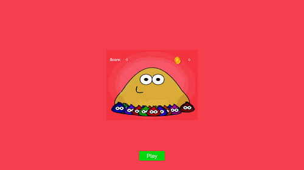
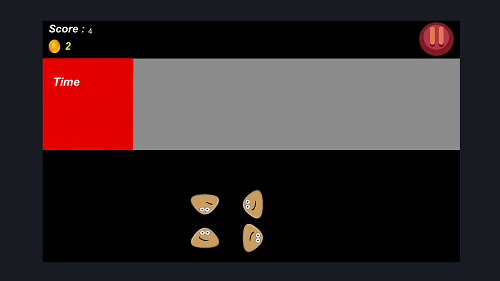
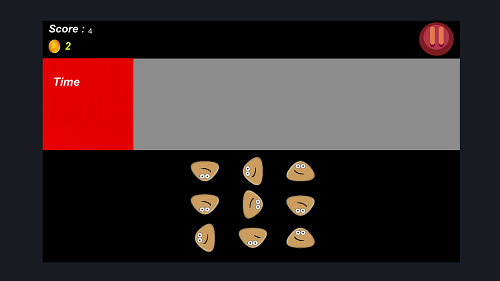

# Sad Tap (Sad Pou)
 
In this game, there is a grid of Pous on the screen. The objective is to tap sad Pous, which then turns them into happy Pous. Tapping happy Pous decreases time, and when the player is out of time, the game ends. When all Pous are happy, the player immediately passes to the next level.

## Language
The project is written in C#(Unity).

## Images
</img> 
</img> 
</img> 

## Contributing
Pull requests are welcome. For major changes, please open an issue first to discuss what you would like to change.

Please make sure to update tests as appropriate.

## License
[ Apache-2.0 License](http://www.apache.org/licenses/)
